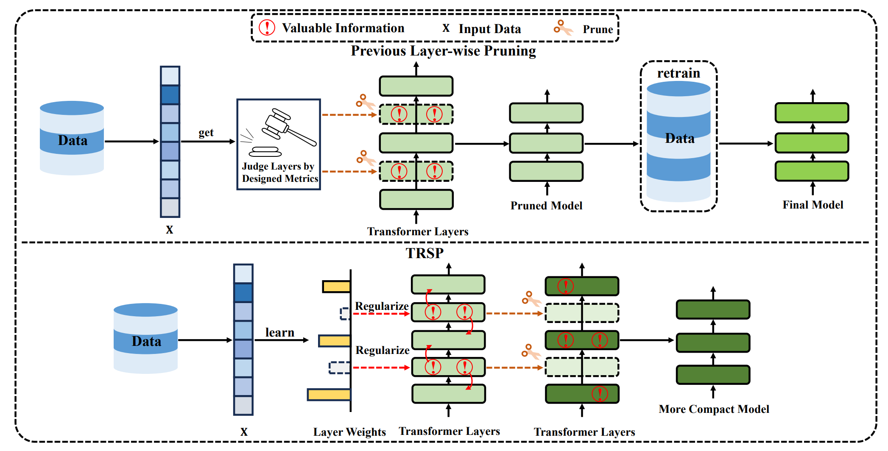
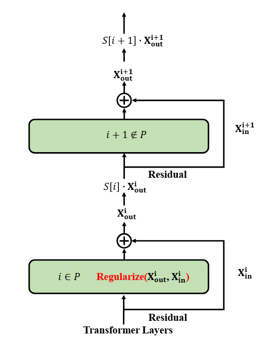

# TRSP: Two-Stage Regularization-Based Structured Pruning for LLMs

<p align="center">
  <b>ACL 2026 Main Conference</b>
</p>

<p align="center">
  <a href="https://arxiv.org/abs/2505.18232"></a>
  <a href="https://github.com/fmk345/TRSP"></a>
  <a href="https://opensource.org/licenses/MIT"></a>
</p>

This is the official implementation of **TRSP: Two-Stage Regularization-Based Structured Pruning for LLMs**.

> **Authors:** Mingkuan Feng\*, Jinyang Wu\*, Siyuan Liu\*, Shuai Zhang†, Hongjian Fang†, Ruihan Jin, Feihu Che, Pengpeng Shao, Zhengqi Wen†, Jianhua Tao†  
> *\* Equal contribution, † Corresponding authors*  
> Tsinghua University, Peking University, Beijing National Research Center for Information Science and Technology

---

## Overview

Structured pruning is a promising approach for compressing LLMs, but existing layer-wise methods directly remove layers based on importance metrics, causing knowledge loss that requires expensive retraining. **TRSP** overcomes this with a novel two-stage regularization-then-prune paradigm:

1. **Stage 1 — Learn Layer Weights:** Iteratively learn a scalar weight for each transformer layer by adding the ℓ₁-norm of these weights as a regularization term to the loss function. Layers are greedily identified for pruning based on their learned weights.

2. **Stage 2 — Knowledge Transfer via Regularization:** Apply ℓ₁/ℓ₂ regularization to the difference between the output and input of layers selected for pruning, encouraging knowledge redistribution to the preserved layers.

3. **Pruning:** Remove the regularized layers directly — **no retraining required**.

<p align="center">
  
  
</p>

### Key Results

- **Superior performance:** Outperforms ShortGPT, SLEB, LaCo, and Shortened LLaMA across all tested models and benchmarks without retraining.
- **20% lower perplexity** than ShortGPT on LLaMA2-7B at 25% pruning ratio.
- **1.35× speedup** and **1.31× throughput increase** on OPT-13B at 25% pruning.
- **Retraining-free:** No post-pruning fine-tuning needed, significantly reducing computational cost.

---

## Repository Structure

```
TRSP/
├── finetune.py                  # Main script: two-stage regularization & pruning
├── finetune_new.py              # Extended training script
├── requirements.txt             # Python dependencies
├── stage2.json                  # DeepSpeed ZeRO Stage 2 config
├── stage3_no_offloading_accelerate.conf  # DeepSpeed ZeRO Stage 3 config
├── script_finetune_*.sh         # Launch scripts for different model sizes
├── utils/
│   ├── model_utils.py           # Model loading utilities
│   ├── data_utils.py            # Data loading (WikiText-2, PTB, C4, Alpaca)
│   ├── eval_utils.py            # Perplexity & zero-shot evaluation
│   ├── block_remove.py          # Layer removal for OPT & LLaMA
│   ├── latency_utils.py         # Throughput & latency measurement
│   ├── output.py                # Output utilities
│   ├── onoff_utils/             # Layer weight scaling & on/off control
│   │   ├── onoff.py             # Unified interface
│   │   ├── onoff_llama.py       # LLaMA-specific layer scaling
│   │   └── onoff_opt.py         # OPT-specific layer scaling
│   └── opt/                     # Custom OPT model with scaling support
│       ├── modeling_opt.py
│       └── configuration_opt.py
└── src/                         # Additional utilities
```

---

## Getting Started

### Requirements

- Python >= 3.9
- PyTorch >= 2.0
- CUDA >= 11.8
- NVIDIA GPU (A100 80GB recommended)

### Installation

```bash
git clone https://github.com/fmk345/TRSP.git
cd TRSP
pip install -r requirements.txt
```

You also need to install [lm-evaluation-harness](https://github.com/EleutherAI/lm-evaluation-harness) for zero-shot evaluation:

```bash
git clone https://github.com/EleutherAI/lm-evaluation-harness.git
cd lm-evaluation-harness
pip install -e .
```

---

## Usage

### Quick Start

Run TRSP on OPT-2.7B with 25% pruning ratio:

```bash
export CUDA_VISIBLE_DEVICES=0

accelerate launch \
    --mixed_precision bf16 \
    --num_machines 1 \
    --num_processes 1 \
    --use_deepspeed \
    --deepspeed_config_file stage2.json \
    finetune.py \
    --model_name_or_path facebook/opt-2.7b \
    --use_flash_attn \
    --dataset_name wikitext2 \
    --lambda_reg 1.0 \
    --eval_ppl \
    --eval_zeroshot \
    --tokenizer_name facebook/opt-2.7b \
    --use_slow_tokenizer \
    --train_file <path_to_wikitext2> \
    --max_seq_length 2048 \
    --nsamples 2048 \
    --preprocessing_num_workers 16 \
    --per_device_train_batch_size 1 \
    --gradient_accumulation_steps 1024 \
    --learning_rate 2e-5 \
    --lr_scheduler_type linear \
    --warmup_ratio 0.03 \
    --weight_decay 0. \
    --num_train_epochs 3 \
    --output_dir ./output/opt-2.7b-pruned/ \
    --with_tracking \
    --report_to tensorboard \
    --logging_steps 1 \
    --use_special_tokens
```

### Multi-GPU Training

For larger models (e.g., OPT-6.7B), use multiple GPUs:

```bash
export CUDA_VISIBLE_DEVICES=0,1

accelerate launch \
    --main_process_port 8889 \
    --mixed_precision bf16 \
    --num_machines 1 \
    --num_processes 2 \
    --use_deepspeed \
    --deepspeed_config_file stage2.json \
    finetune.py \
    --model_name_or_path facebook/opt-6.7b \
    --use_flash_attn \
    --dataset_name wikitext2 \
    --lambda_reg 1.0 \
    --eval_ppl \
    --eval_zeroshot \
    --tokenizer_name facebook/opt-6.7b \
    --use_slow_tokenizer \
    --train_file <path_to_wikitext2> \
    --max_seq_length 2048 \
    --nsamples 2048 \
    --preprocessing_num_workers 16 \
    --per_device_train_batch_size 1 \
    --gradient_accumulation_steps 512 \
    --learning_rate 2e-5 \
    --lr_scheduler_type linear \
    --warmup_ratio 0.03 \
    --weight_decay 0. \
    --num_train_epochs 3 \
    --output_dir ./output/opt-6.7b-pruned/ \
    --with_tracking \
    --report_to tensorboard \
    --logging_steps 1 \
    --use_special_tokens
```

### Key Arguments

| Argument | Description | Default |
|---|---|---|
| `--model_name_or_path` | Pretrained model path or HuggingFace model name | — |
| `--dataset_name` | Calibration dataset (`wikitext2`, `ptb`, `c4`, `alpaca`) | `wikitext2` |
| `--lambda_reg` | Regularization strength (λ) | `1.0` |
| `--nsamples` | Number of calibration samples | `2048` |
| `--max_seq_length` | Maximum sequence length | `2048` |
| `--eval_ppl` | Evaluate perplexity after pruning | `False` |
| `--eval_zeroshot` | Evaluate on zero-shot benchmarks after pruning | `False` |
| `--use_flash_attn` | Enable Flash Attention | `False` |

---

## Supported Models

| Model Family | Models |
|---|---|
| **OPT** | OPT-2.7B, OPT-6.7B, OPT-13B |
| **LLaMA 2** | LLaMA2-7B, LLaMA2-13B, LLaMA2-70B |
| **LLaMA 3** | LLaMA3-8B |
| **Phi** | Phi-2 |

---

## Main Results

### Performance at 25% Pruning Ratio (no retraining for TRSP)

| Model | Method | PPL ↓ | Avg Acc (%) ↑ |
|---|---|---|---|
| **LLaMA2-7B** | Dense | 5.47 | 69.00 |
| | ShortGPT | 8.89 | 57.10 |
| | SLEB | 9.63 | 54.79 |
| | **TRSP** | **7.08** | **60.57** |
| **LLaMA3-8B** | Dense | 5.76 | 75.62 |
| | ShortGPT | 9.26 | 66.17 |
| | SLEB | 10.38 | 63.12 |
| | **TRSP** | **7.68** | **68.38** |
| **LLaMA2-13B** | Dense | 4.88 | 71.76 |
| | ShortGPT | 6.79 | 62.96 |
| | SLEB | 7.08 | 58.59 |
| | **TRSP** | **5.82** | **65.11** |

### Acceleration (25% Pruning)

| Model | Throughput ↑ | Latency Speedup ↑ |
|---|---|---|
| OPT-13B | 1.31× | 1.35× |
| LLaMA2-13B | 1.30× | 1.33× |

---

## Hyperparameter Recommendations

Based on our grid search experiments (see Appendix C in the paper), we recommend:

- **λ₁** (Stage 1 regularization weight): `5 × 10⁻³`
- **λ₂** (Stage 2 regularization weight): `10⁻³`
- **Calibration samples**: 128 sequences of length 2048
- **Calibration dataset**: WikiText-2 (robust across datasets, see Section 4.5)

---

## Citation

If you find TRSP useful for your research, please cite our paper:

```bibtex
@inproceedings{feng2026trsp,
  title={Two-Stage Regularization-Based Structured Pruning for LLMs},
  author={Feng, Mingkuan and Wu, Jinyang and Liu, Siyuan and Zhang, Shuai and Fang, Hongjian and Jin, Ruihan and Che, Feihu and Shao, Pengpeng and Wen, Zhengqi and Tao, Jianhua},
  booktitle={Proceedings of the 64th Annual Meeting of the Association for Computational Linguistics (ACL)},
  year={2026}
}
```

## Acknowledgments

This work is supported by the National Natural Science Foundation of China (No. U21B2010) and the China Postdoctoral Science Foundation (Grant No. 2025T180461 and 2025M771685).

## License

This project is licensed under the MIT License. See the [LICENSE](LICENSE) file for details.
